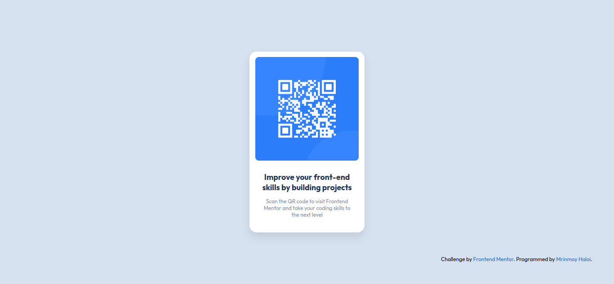

# Frontend Mentor - QR code component solution

This is a solution to the [QR code component challenge on Frontend Mentor](https://www.frontendmentor.io/challenges/qr-code-component-iux_sIO_H). Frontend Mentor challenges help you improve your coding skills by building realistic projects. 

## Table of contents

- [Overview](#overview)
  - [Screenshot](#screenshot)
  - [Links](#links)
- [My process](#my-process)
  - [Built with](#built-with)
  - [What I learned](#what-i-learned)
- [Author](#author)

## Overview

### Screenshot



### Links

- Solution URL: [Add solution URL here](https://your-solution-url.com)
- Live Site URL: [Add live site URL here](https://your-live-site-url.com)

## My process

### Built with

- Sveltekit
- SCSS
- Flexbox
- CSS Grid

### What I learned

This project was relatively easy to complete. I didn't learnt much but I learnt about frontend mentor and how to use it. Looking forward to complete more challenges.

## Author

- Website - [mrinmoy.is-a.dev](https://mrinmoy.is-a.dev)
- Frontend Mentor - [@MrinmoyHaloi](https://www.frontendmentor.io/profile/MrinmoyHaloi)
- Twitter - [@_mrinmoy_haloi_](https://www.twitter.com/_mrinmoy_haloi_)


## Developing

### Install dependencies
```bash
pnpm install
```

### Start the dev server

```bash
pnpm dev
```